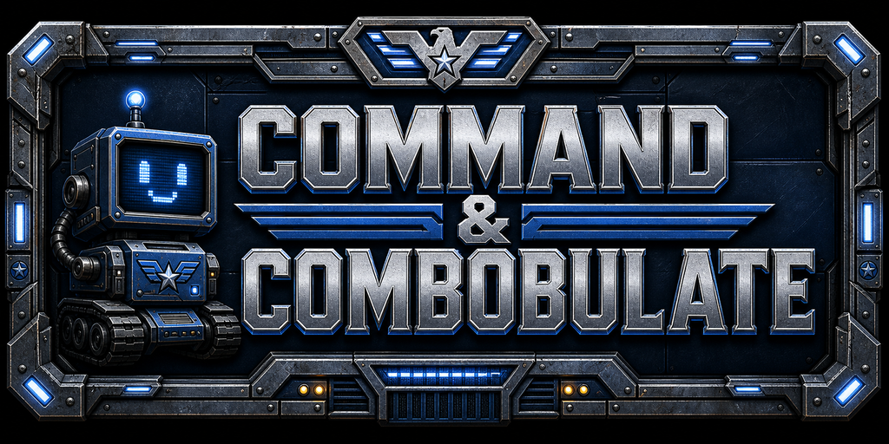

# Command & Combobulate


<video width="1280" height="720" src="assets/demo002.mp4" controls></video>


Run an AI agent inside a terminal you build in-game and watch it play out on an OpenRA map: every
file it reads or writes, every command it runs, and every subagent it spawns shows
up as units, buildings, and resources you scout through fog of war.

It is two pieces:

- **`server/`** — a small Node backend. Agent adapters POST their tool calls to it,
  and it hosts the real terminals (`node-pty`). It streams a live world and terminal
  I/O over WebSocket.
- **`command-and-combobulate/`** — an [OpenRA Mod SDK](https://github.com/OpenRA/OpenRAModSDK)
  mod that connects to the backend and renders that world inside the OpenRA engine.

## Prerequisites

- [`mise`](https://mise.jdx.dev) (pins Bun + Node) — or Bun and Node 22 directly.
- **.NET 8 SDK** (or Mono) and **python3** — to build and launch the OpenRA engine.
- **Red Alert game content.** The mod reuses OpenRA's Red Alert art, so install
  [OpenRA](https://www.openra.net) and launch Red Alert once to download its content.

## Quick start

```sh
mise install        # Bun + Node, pinned in mise.toml
bun install         # backend deps (compiles node-pty's native PTY)
bun run setup       # wire the agent adapters (Claude, Codex)
bun run dev         # start the Node backend — keep this running
```

In a second shell, build and launch the mod. The first `make` fetches the pinned
OpenRA engine and builds it (a few minutes):

```sh
cd command-and-combobulate
make                 # fetch engine + build the mod
./launch-game.sh     # launch
```

(Or just `bun run game` from the repo root, which runs both.)

In the menu, click **Start Clanking**. You start with a small base and a few
scouts. Build a **Terminal**, select it, click the panel to focus it, and run an
agent:

```sh
claude        # also: codex
```

The agent appears as a unit and starts working the map. Scout outward to reveal
what other agents are doing. The adapters only report from inside a Command &
Combobulate terminal (where `COMBOBULATE_SESSION` is injected), so they stay quiet
everywhere else.

## What you see

- **Terminals** — buildings you produce; each hosts an agent's shell.
- **Agents** — one unit per agent (a different unit per tool), walking to the
  folder it is touching and showing read / write / run.
- **Folders** — walled compounds laid out as a directory tree, cabled to the
  terminal working in them.
- **Files** — small civilian buildings inside a folder, one per file (the
  building varies by file type).
- **Fog of war** — the world is hidden until your commander scouts it.

## Layout

- `server/` — the backend (event ingest + PTY hosting).
- `command-and-combobulate/` — the OpenRA mod: SDK scaffold, `mods/combobulate/` (yaml,
  art, maps) and `OpenRA.Mods.Combobulate/` (C# traits and widgets).
- `integrations/` — the Claude and Codex adapters installed by `bun run setup`.
- `docs/` — design notes.

> The backend runs under **Node** (for `node-pty`); tests run under **Bun**
> (`bun test`). `bun install` compiles `node-pty`, which needs a C/C++ toolchain
> (`python3`, `make`, `g++`) — present on most dev machines.

## Inspired by

- [EXAPUNKS](https://www.zachtronics.com/exapunks/) — its hosts, files, and links.
